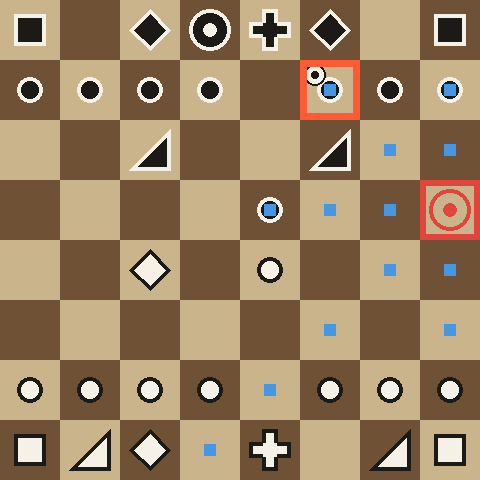

# Chess example

This example teaches the package's screen policy to play chess with a game controller. It imports the same `jevlike.vision.DoomScorerV2` network as Doom: a small convolutional stem over the frame, 8 by 10 patches with fixed positions added to the attention keys, one attention read per controller option, and a softmax over the options. The network has one table of 12 option embeddings. Ids 0 to 6 are the Doom buttons and ids 7 to 11 are the chess keys: up, down, left, right and one pick-up/put-down button. Nothing tells the network which game it is playing except the frame.



## The game as a screen

The board is drawn into the same 160 by 120 frame as Doom, as a 120 by 120 square with black margins. The side to move is always at the bottom. A yellow border marks the cursor. When a piece is lifted, the border turns orange, the piece rides on the cursor, its starting square is outlined in red, and small blue dots mark its legal destinations, as chess websites show them. The frame is the whole state.

The arrow keys move the cursor one square and stop at the edge. The button lifts one of your own pieces. Pressed while holding a piece, it puts the piece down on a legal square and plays the move, does nothing on an illegal square, and drops the piece back on its starting square. Promotions are always to a queen.

## Install

From the repository root:

```sh
uv venv
source .venv/bin/activate
uv pip install -e '.[dev,games]'
# Install Stockfish with your platform's package manager and put it on PATH.
```

Run the scripts from this directory. They import the shared network from the installed `jevlike` package.

```sh
cd examples/chess
python test_smoke.py
```

## Play and evaluate the supplied checkpoint

```sh
python eval.py checkpoints/chess-dagger1.pt --games 50 --sample --device mps
python play.py checkpoints/chess-dagger1.pt --games 10 --opponent random --sample --out runs/trace.json --frames-dir runs/frames
```

`eval.py` plays games against a uniform random mover, Stockfish at skill level 0 and Stockfish at skill level 3. The model plays both colours. `--sample` draws each key from the model's probabilities; without it the model takes the most likely key. `play.py` writes a paced trace in the Doom example's format, with the 480 by 480 board picture for every key press.

## Train

1. Generate positions labelled with a Stockfish teacher move (depth 10). The first command uses noisy low-strength Stockfish self-play after a few random opening moves. The second plays Stockfish against a random mover and keeps only the strong side's positions, so the data holds won endgames.

   ```sh
   python positions.py --out runs/positions --workers 12 --train 80000 --heldout 4000
   python positions.py --vs-random --out runs/positions-vr --workers 8 --train 40000 --heldout 0 --seed 2
   ```

2. Train on key sequences. From a random cursor square, the teacher walks the cursor to the piece, rows first and then columns, lifts it, walks to the destination and puts it down. Every screen on the way is one training frame, labelled with the next key.

   ```sh
   python train.py --steps 16000 --lr 3e-3 --dagger 0 --name pretrain
   ```

3. Correct the model's own mistakes. Play games with the trained model and save every state it reaches, including wrong turns, and label each with the teacher's next key from that state. Then train on a 50/50 mix of teacher walks and these states. This is DAgger (dataset aggregation).

   ```sh
   python dagger.py runs/pretrain.pt --games 200 --device mps --out runs/dagger/a.jsonl
   python train.py --init runs/pretrain.pt --steps 6000 --lr 1e-3 --dagger 0.5 --name dagger1
   ```

The supplied checkpoint came from 7,500 steps of step 2 and 6,000 steps of step 3.

## Results

The checkpoint was evaluated over 50 games against each opponent, 25 as white and 25 as black, with sampled keys. A turn has a budget of 40 key presses; if the model has not played a move by then, a random legal move is played and counted as a failure. Games stop as draws after 200 plies. Centipawn loss is Stockfish's judgement at depth 10 of how much worse each of the model's own moves was than the best move.

| Opponent | Wins | Draws | Losses | Wasted presses | Keys per move | Budget failures | Centipawn loss |
|---|---|---|---|---|---|---|---|
| Random mover | 4 | 46 | 0 | 4% | 11.8 | 14% | 288 |
| Stockfish level 0 | 0 | 2 | 48 | 4% | 13.0 | 17% | 155 |
| Stockfish level 3 | 0 | 0 | 50 | 4% | 13.3 | 15% | 144 |

A wasted press is an arrow against the edge, the button on an empty square, or an illegal put-down. The network takes about 0.7 ms per key press on Apple MPS.

In plain terms, the model has learned the controller but not chess. It rarely wastes a press, and it wins material against a random mover: in 35 of the 42 games stopped at 200 plies it was at least three points of material ahead. It seldom delivers checkmate, though, and it loses almost every game to Stockfish at its lowest skill level.

Choosing the most likely key every time is much worse than sampling: for a checkpoint halfway through step 3, 68% of moves hit the key budget. With nothing but the screen as memory, a press that changes nothing, or two presses that undo each other, repeats forever.

## What limits it

- **Reading the board works.** Trained to name the cursor's square from the frame, the network was right 99.95% of the time on held-out positions.
- **Walking to a marked square works.** When the teacher's target square was marked on the screen, next-key accuracy reached 94% after 1,250 steps.
- **Choosing the move is the limit.** Without the mark, held-out next-key accuracy levels off near 65%, and training accuracy stops at the same level. A network twice as wide was no better at the same training step.
- **The dots help.** The legal-move dots added about seven points of key accuracy.
- **Recovery training helps.** Training on the model's own states (step 3) cut wasted presses in sampled play from 24% to 4% across our runs.
